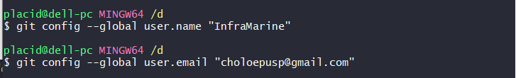
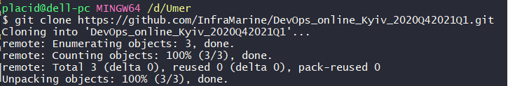
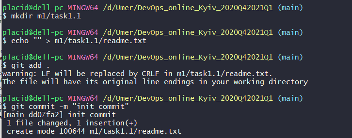
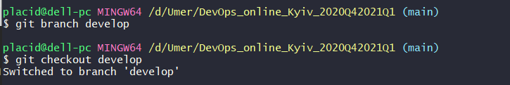
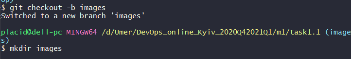
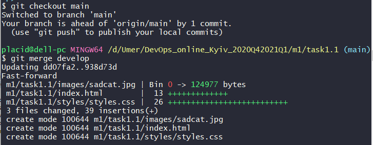
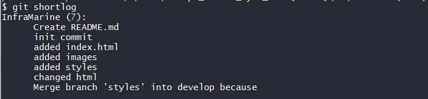
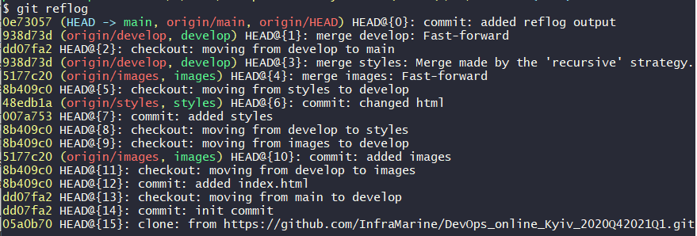

## Module 1 DevOps Introduction

## TASK 1.1 (Git)

### DevOps is ...

DevOps is a methodology which breaks the gap between development and operations. It allows continuous deployment and delivery of a product.
It is archived via automatization of builds, infrastructure deployment, testing and publishing.
DevOps works close with developers and ensures that may change how product is deployed can be implemented without delays.

### Git commands used

* `git config` to setup username, email and core editor

 
* `git clone` 

 

* `git add .` and `git commit -m "<message>"` to add files to be tracked and commit them

* `git branch <branch_name>` to create a new branch
* `git checkout <branch_name>` to go to branch_name

  * *This can be done in one command:* `git checkout -b <branch_name>` 
  
  

* `git merge <branch1>` to merge branch1 into a current branch, **need to provide a message with `-m` option if files from current branch to be changed** 

* `git log` 
  * `git shortlog` usefull for short message about changes 
  
  
  
  * `git log --oneline --graph` 
  
  
  
  * `git reflog` 
  
  
  
[reflog output file](task1.1_GIT.txt)
