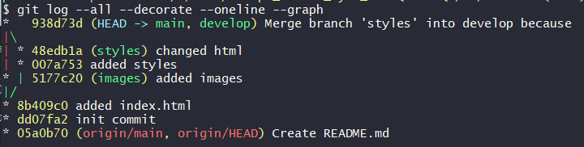

## Module 1 DevOps Introduction

### TASK 1.1 (Git)

### DevOps is ...

#### Git commands used

* `git config` to setup username, email and core editor

 
* `git clone`
 

* `git add .` and `git commit -m "<message>"` to add files to be tracked and commit them

* `git branch <branch_name>` to create a new branch
* `git checkout <branch_name>` to go to branch_name

*This can be done in one command: `git checkout -b <branch_name>`*

* `git merge <branch1>` to merge branch1 into a current branch, **one need to provide a message with `-m` option if files from current branch to be changed** 

* `git log`
  * `git shortlog`
  
  * `git log --oneline --graph`
  
  * `git reflog`
  
