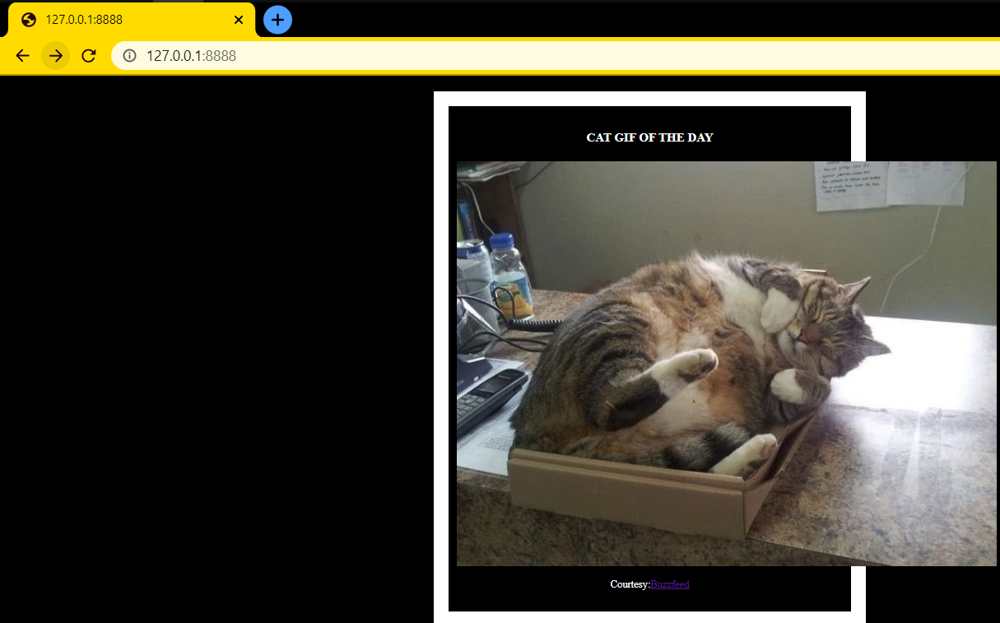

### Docker

Running Docker container:

Using docker lection2 create a docker image with Python Flask app that displays random cat pix.

Followed steps in the lection, but used another links for cat pics (cats from lection2 were dead)

Docker running on port 8888 for external world, and log of requests:

```
jita@ubuntux:~/flask-app$ sudo docker run -p 8888:5000 --name mycatapp medoth/mycatapp
 * Running on http://0.0.0.0:5000/ (Press CTRL+C to quit)
10.0.2.2 - - [03/Mar/2021 17:21:17] "GET / HTTP/1.1" 200 -
10.0.2.2 - - [03/Mar/2021 17:21:18] "GET /favicon.ico HTTP/1.1" 404 -
10.0.2.2 - - [03/Mar/2021 17:22:37] "GET / HTTP/1.1" 200 -
10.0.2.2 - - [03/Mar/2021 17:22:46] "GET / HTTP/1.1" 200 -
10.0.2.2 - - [03/Mar/2021 17:22:56] "GET / HTTP/1.1" 200 -
```

Flask app:



> `docker ps` shows list of running containers:

```
jita@ubuntux:~$ docker ps
CONTAINER ID   IMAGE             COMMAND                  CREATED         STATUS         PORTS                    NAMES
e1657b4eb327   medoth/mycatapp   "python /usr/src/app…"   6 minutes ago   Up 6 minutes   0.0.0.0:8888->5000/tcp   mycatapp
```

> To to stop and remove container use `docker rm -f CONTAINER_ID`