# Module 2 Virtualization and Cloud Basic

## TASK 2.1

#### PART 1. HYPERVISORS

1. What are the most popular hypervisors for infrastructure virtualization?

  - _Oracle VirtualBox_ - hosted
  - _VMWare Workstation_ (paid), _Player_ (free) - hosted and _vSphere_ - bare metal
  - _KVM_ - integrated linux kernel virtualisation, hosted & bare metal at the same time, supports containers
  - _Microsoft Hyper-V_
  
2. Briefly describe the main differences of the most popular hypervisors.

  * One of the most important aspect for a hypervisor is a pricing. KVM is open source, Hyper-V is free but Windows quests each must be licensed. VMWare solution's are paid except trials and limited versions.
  * VMWare Workstation is more advanced in networking as it has _Network Manager_, and for example NAT-quest can be accessed without a port translation.
  * VirtualBox is open source and supports more platforms.

#### PART 2. WORK WITH VIRTUALBOX
1. First run VirtualBox and Virtual Machine (VM).

...

  1.3 Create VM1 and install Ubuntu using the instructions . Set machine name as "host machine name"_"student last name"

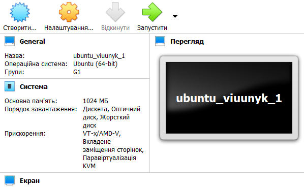

  1.5 Clone an existing VM1 by creating a VM2.

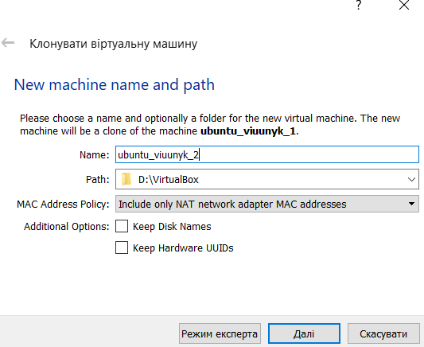

  1.6 Create a group of two VM: VM1, VM2 and learn the functions related to groups.

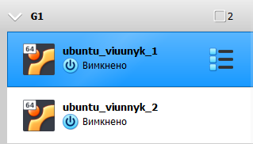

  1.7 For VM1, changing its state, take several different snapshots, forming a branched tree of snapshots.

> Shortcut for snapshot is `HostKey+T`

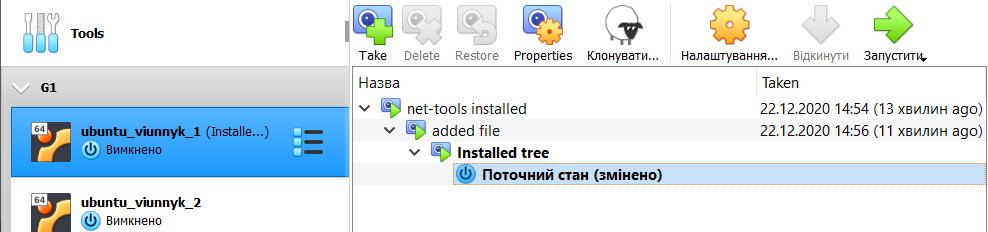

  1.8 Export VM1. Save the *.ova file to disk. Import VM from *.ova file.

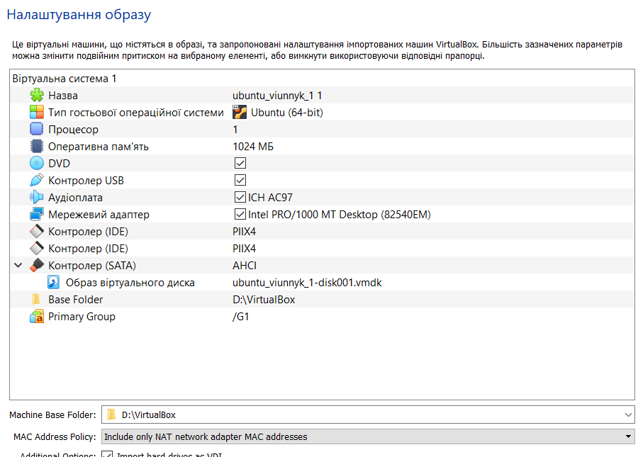

2. Configuration of virtual machines

  2.1 Explore VM configuration options (general settings, system settings, display, storage, audio, network, etc.).

  2.2 Configure the USB to connect the USB ports of the host machine to the VM.

Usb Controller is enabled by default.
USB device needs to be checked as connected.

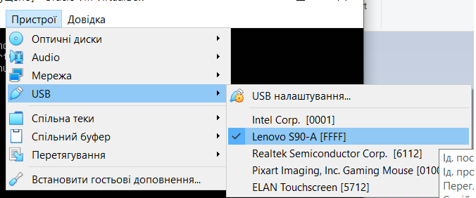

Now I can see it in my quest using `lsusb` command

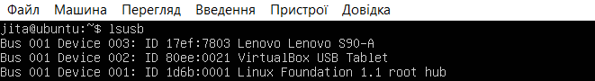

  2.3 Configure a shared folder to exchange data between the virtual machine and the host.
Created shared folder:

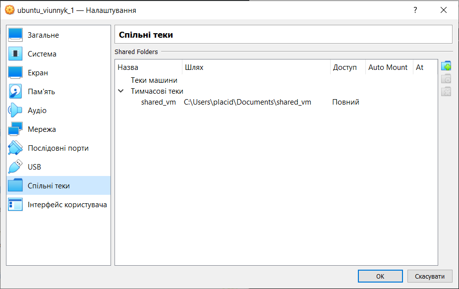

> `virtualbox-guest-utils` are needed to mount folder, install :
> `sudo apt-get install virtualbox-guest-utils`

Manual mounting:

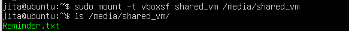

Entry to /etc/fstab allows mount on boot:

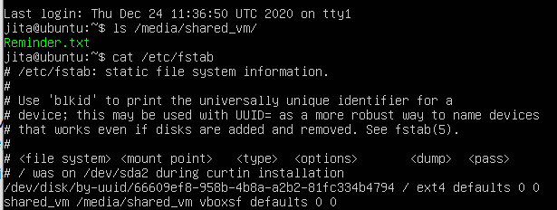

  2.4 Configure  different  network  modes  for  VM1,  VM2.  Check  the  connection between VM1, VM2, Host, Internet for different network modes. You can use the `ping` command to do this. Make a table of possible connections.

Mode | VM -> Host | Host -> VM | VM1 <--> VM2| VM <--> Net
--- | --- | --- | --- | ---
Host-only | + | + | + | -
Bridged   | + | + | + | +
NAT       | + | - | - | +

3. Work with CLI through VBoxManage.

  3.1 Run the cmd.exe command line.
  3.2 Examine  the  purpose  and  execute  the  basic  commands  of  VBoxManage list, showvminfo, createvm, startvm, modifyvm, clonevm, snapshot, controlvm

  * `list` - shows info about vms, running vms, network etc.
  
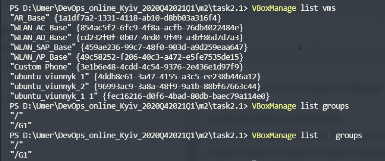

  * `showvminfo <vm_name|uuid>` - shows all info about vm such as: config, state (running, currently attached devices), snapshot tree
  
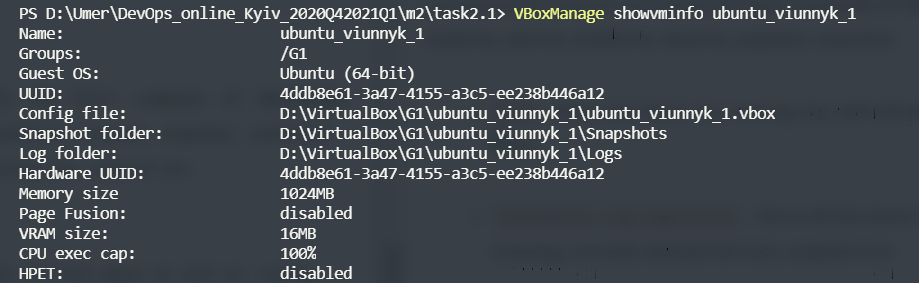

  *  `createvm`- creates vm
  *  `startvm` - starts vm
  *  `modifyvm` - changes vm's config
  


  *  `clonevm` - clones vm, can clone from snapshot with option `--snapshot` 
  *  `snapshot` - creates, lists, restores to, deletes snapshots
  *  `controlvm` - manages running vm.
  
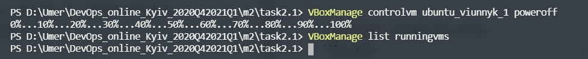

#### PART 3. WORK WITH VAGRANT

1. Install Vagrant.
2. Run the powershell. Create a folder "student name" (in English). In this example, create a folder vagrant_test. Next, go to the folder.

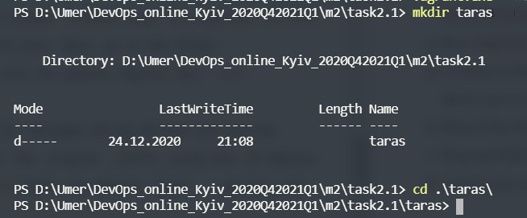

3. Initialize the environment with the default Vagrant box: `init hashicorp/precise64`

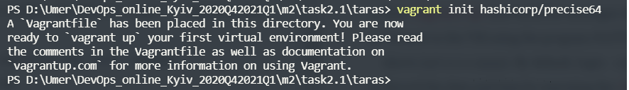

4. Run `vagrant up` and watch for messages during VM boot and startup.

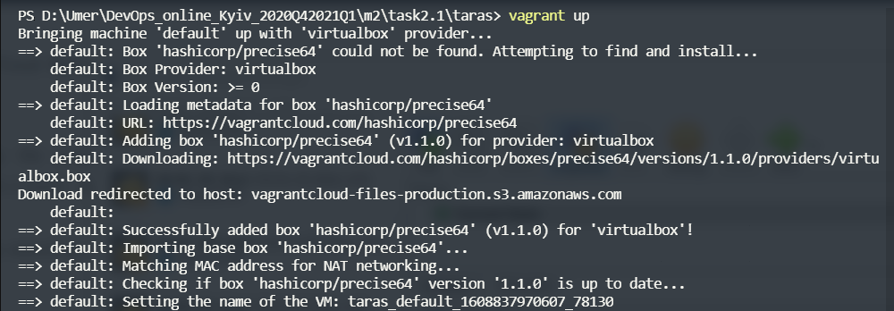

5. Connect  to  the  VM using SSH, IP address and port listed above (127.0.0.1:2222). By default, login - _vagrant_ and password are also _vagrant_
6. Record the date and time by executing the `date` command

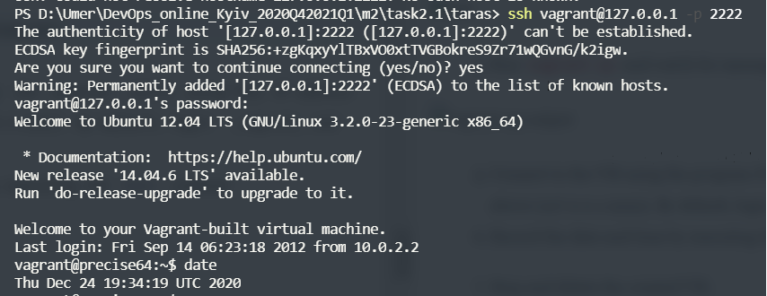

7. Stop and delete the created VM.
```
PS D:\Umer\DevOps_online_Kyiv_2020Q42021Q1\m2\task2.1\taras> vagrant halt
==> default: Attempting graceful shutdown of VM...
PS D:\Umer\DevOps_online_Kyiv_2020Q42021Q1\m2\task2.1\taras> vagrant destroy
    default: Are you sure you want to destroy the 'default' VM? [y/N] ==> default: Destroying VM and associated drives...
```

8. Create your own Vagrant box

Simly added apache, mysql and php. `vagrant up` output:

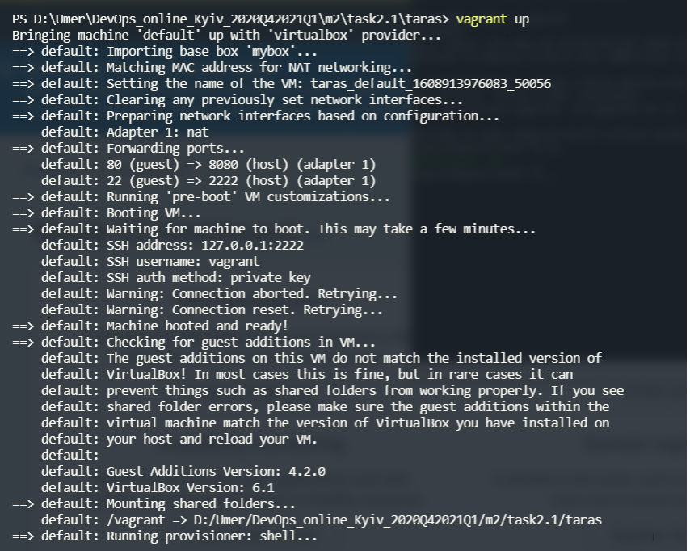

[Vagrant file](taras/Vagrantfile)
