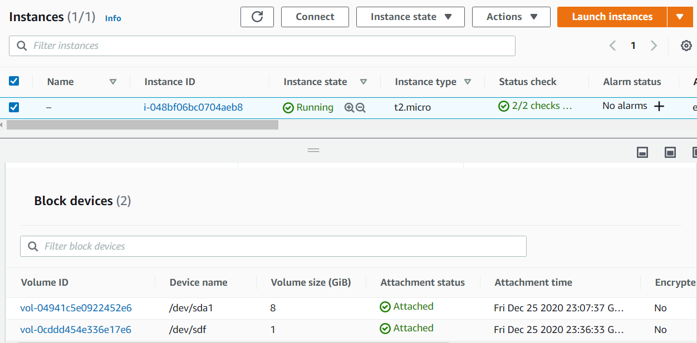
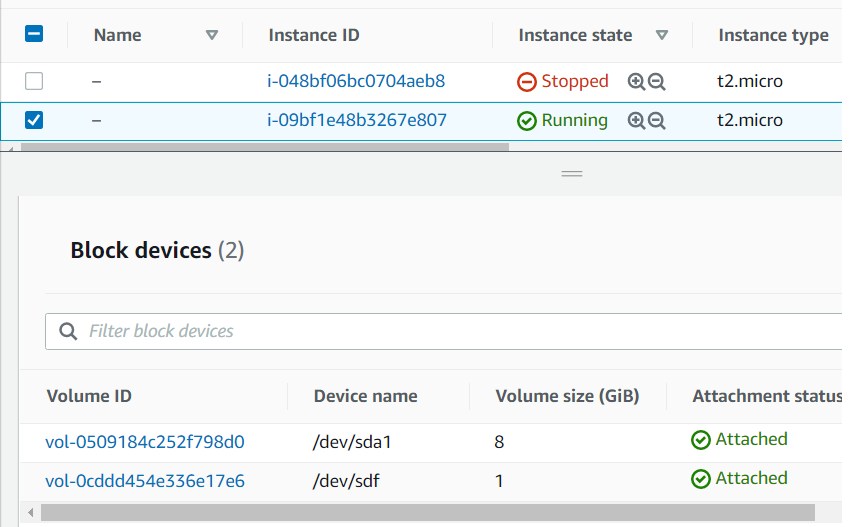
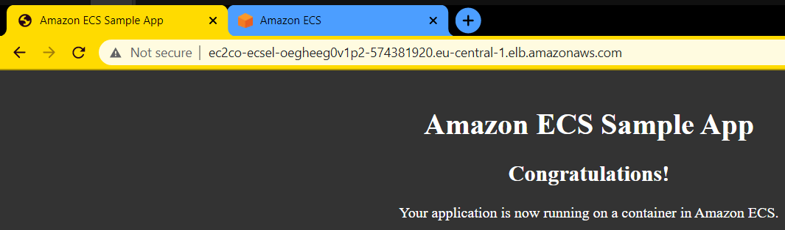

## Module 2 Virtualization and Cloud Basic

### TASK 2.2

* Create and attach a Disk_D (EBS)to your instance to add more storage space. Create and save some file on Disk_D.

  * Instance with volume attached:

  
  
  * mounting and file creation:
  
 ``` 
[centos@ip-172-31-32-80 ~]$ lsblk
NAME    MAJ:MIN RM SIZE RO TYPE MOUNTPOINT
xvda    202:0    0   8G  0 disk
└─xvda1 202:1    0   8G  0 part /
xvdf    202:80   0   1G  0 disk
[centos@ip-172-31-32-80 ~]$ sudo mkfs -t xfs /dev/xvdf
meta-data=/dev/xvdf              isize=512    agcount=4, agsize=65536 blks 
		 =                       sectsz=512   attr=2, projid32bit=1
		 =                       crc=1        finobt=0, sparse=0
data     =                       bsize=4096   blocks=262144, imaxpct=25
		 =                       sunit=0      swidth=0 blks
naming   =version 2              bsize=4096   ascii-ci=0 ftype=1
log      =internal log           bsize=4096   blocks=2560, version=2
		 =                       sectsz=512   sunit=0 blks, lazy-count=1
realtime =none                   extsz=4096   blocks=0, rtextents=0
[centos@ip-172-31-32-80 ~]$ sudo mkdir /media/d 
[centos@ip-172-31-32-80 ~]$ sudo mount /dev/xvdf /media/d
[centos@ip-172-31-32-80 ~]$ sudo chmod 777 /media/d
[centos@ip-172-31-32-80 ~]$ echo "Hi" > /media/d/somefile                                                   
[centos@ip-172-31-32-80 ~]$ cat /media/d/somefile  
Hi
```

* Launch the third instance from backup.
* Detach Disk_D from the 2nd instance and attach disk_D to the new instance.



`somefile` is now accessible to new instance

```
[centos@ip-172-31-37-19 ~]$ lsblk 
NAME    MAJ:MIN RM SIZE RO TYPE MOUNTPOINT 
xvda    202:0    0   8G  0 disk
└─xvda1 202:1    0   8G  0 part /
xvdf    202:80   0   1G  0 disk
[centos@ip-172-31-37-19 ~]$ mkdir disk_d
[centos@ip-172-31-37-19 ~]$ sudo mount /dev/xvdf disk_d/ 
[centos@ip-172-31-37-19 ~]$ ls disk_d/ 
somefile 
```

* Review the 10-minute example Batch upload files to the cloud to Amazon S3 using the AWS CLI.
Create a user AWS IAM, configure CLI AWS and upload any files to S3.

> **AWS CLI** can also be installed via `pip install awscli`


  * File upload and removal:
  
```
PS D:\Umer\DevOps_online_Kyiv_2020Q42021Q1\m2\task2.2> aws s3 cp .\README.md s3://vidrops/
upload: .\README.md to s3://vidrops/README.md
PS D:\Umer\DevOps_online_Kyiv_2020Q42021Q1\m2\task2.2> aws s3 rm  s3://vidrops/README.md
delete: s3://vidrops/README.md
```

* Review the 10-minute example Deploy Docker Containers on Amazon Elastic Container Service (Amazon ECS).
Repeat, create a cluster, and run the online demo application.

  Hands-on tutorial describes creating cluster with EC2 and manually created Elastic Load Balancing (ELB) load balancer.
  Link to console in tutorial however leads to first run wizard that uses **Fargate**.
  It requires no manual ELB and does not create EC2 instances.
  
  Sample app screen:
  
  
  
##  [My static website](http://vidrops.s3-website.eu-central-1.amazonaws.com)