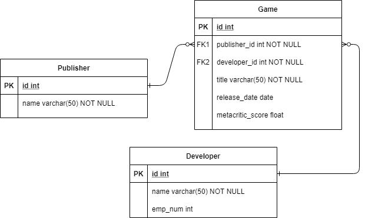
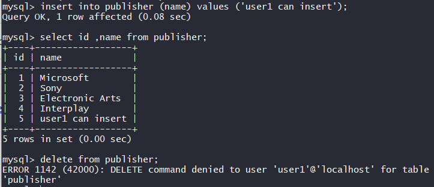
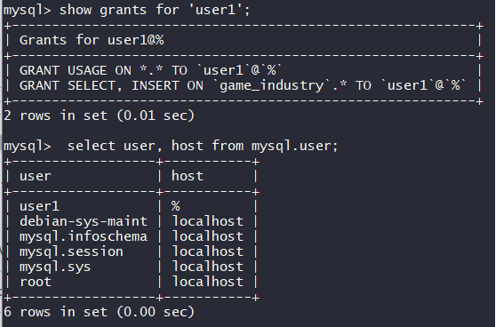
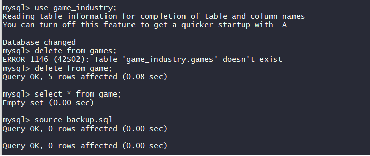
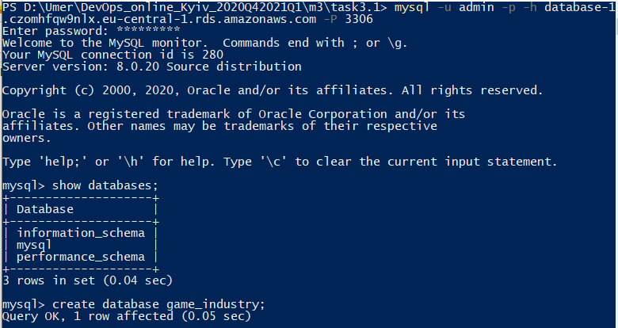
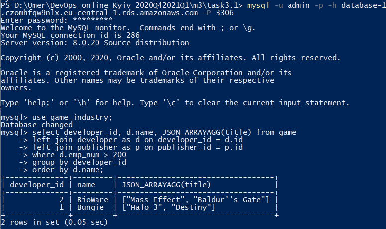
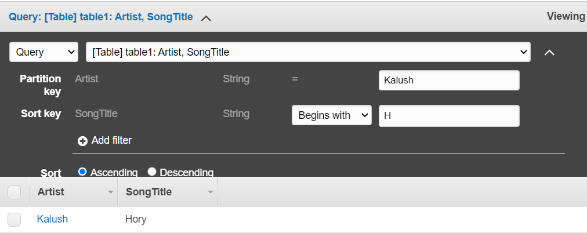

## Module 3Database Administration

### TASK 3.1

#### PART 1

* Select a subject area anddescribe the database schema, (minimum 3 tables)



* Create a database on the server through the console
Database created with script below, `sudo mysql < init.sql`:
 
```
use game_industry ;

create table if not exists developer (
id int unsigned auto_increment primary key,
name varchar(50) not null,
emp_num int unsigned
) ;

create table if not exists publisher (
id int unsigned auto_increment primary key,
name varchar(50) not null
) ;

create table if not exists game (
id int unsigned auto_increment,
title varchar(50) not null,
developer_id int unsigned not null,
publisher_id int unsigned not null,
release_date date,
metacritic_score float(5,2),
primary key(id),
foreign key (developer_id)
        references developer (id)
        on delete cascade,
foreign key (publisher_id)
        references publisher(id)
        on delete cascade
) ;
```

* Fill in tables.

  * developer
  
```
mysql> insert into developer (name, emp_num) values ('Bungie', 600), ('BioWare',
 800), ('Naughty Dog', 170);
Query OK, 3 rows affected (0.06 sec)
Records: 3  Duplicates: 0  Warnings: 0

mysql> select * from developer;
+----+-------------+---------+
| id | name        | emp_num |
+----+-------------+---------+
|  1 | Bungie      |     600 |
|  2 | BioWare     |     800 |
|  3 | Naughty Dog |     170 |
+----+-------------+---------+
3 rows in set (0.00 sec)
```

  * publisher
  
```  
mysql> insert into publisher (name)
    -> values ('Microsoft'), ('Sony'), ('Electronic Arts');
Query OK, 3 rows affected (0.03 sec)
Records: 3  Duplicates: 0  Warnings: 0

mysql> insert into publisher (name) values ('Interplay');
Query OK, 1 row affected (0.07 sec)

mysql> select * from publisher;
+----+-----------------+
| id | name            |
+----+-----------------+
|  1 | Microsoft       |
|  2 | Sony            |
|  3 | Electronic Arts |
|  4 | Interplay       |
+----+-----------------+
4 rows in set (0.00 sec)
```

  * game

```
mysql> insert into game (title, release_date, metacritic_score, publisher_id, developer_id)
    -> values ("Mass Effect", '2007-11-20', 8.6, 1, 2),
    -> ("Baldur''s Gate",'1998-12-21', 8.9, 4, 2),
    -> ("Halo 3", '2007-09-25', 8.0, 1, 1),
    -> ("Destiny", '2014-09-09', 4.8, 1, 1),
    -> ("The Last of Us Part II", '2014-06-19', 5.7, 2, 3);
Query OK, 5 rows affected (0.01 sec)
Records: 5  Duplicates: 0  Warnings: 0
mysql> select game.id, game.title, d.name, p.name from game left join developer
as d on developer_id = d.id left join publisher as p on publisher_id = p.id order by title;
+----+------------------------+-------------+-----------+
| id | title                  | name        | name      |
+----+------------------------+-------------+-----------+
|  7 | Baldur''s Gate         | BioWare     | Interplay |
|  9 | Destiny                | Bungie      | Microsoft |
|  8 | Halo 3                 | Bungie      | Microsoft |
|  6 | Mass Effect            | BioWare     | Microsoft |
| 10 | The Last of Us Part II | Naughty Dog | Sony      |
+----+------------------------+-------------+-----------+
```

* Construct and execute SELECT operator with WHERE, GROUP BY and ORDER BY.

```
mysql> select developer_id, d.name, JSON_ARRAYAGG(title) from game
    -> left join developer as d on developer_id = d.id
    -> left join publisher as p on publisher_id = p.id
    -> where d.emp_num > 200
    -> group by developer_id
    -> order by d.name;
+--------------+---------+-----------------------------------+
| developer_id | name    | JSON_ARRAYAGG(title)              |
+--------------+---------+-----------------------------------+
|            2 | BioWare | ["Mass Effect", "Baldur''s Gate"] |
|            1 | Bungie  | ["Halo 3", "Destiny"]             |
+--------------+---------+-----------------------------------+
2 rows in set (0.07 sec)
```
* Create a database of new users with different privileges.
  Connect to the database as a new user and verify that the privileges allow or deny certain actions.
* Make a selection from the main table DB MySQL.

New user creation, granted **SELECT** and **INSERT** privileges:

```
mysql> create user 'user1'@'%' identified by 'pass1';
Query OK, 0 rows affected (0.10 sec)
mysql> GRANT SELECT, INSERT ON game_industry.* to user1@'%';
Query OK, 0 rows affected (0.07 sec)
```

After logging as a new user (user1), insert is permitted and delete is not:



Grants of _user1_ and mysql.user table selection



#### PART 2

* Make backup of your database.

```
jita@ubuntu:~$ sudo mysqldump -u root -p game_industry > backup.sql
Enter password:
jita@ubuntu:~$ ls
backup.sql  dir1  init.sql
jita@ubuntu:~$ tail backup.sql
==> backup.sql <==

/*!40101 SET SQL_MODE=@OLD_SQL_MODE */;
/*!40014 SET FOREIGN_KEY_CHECKS=@OLD_FOREIGN_KEY_CHECKS */;
/*!40014 SET UNIQUE_CHECKS=@OLD_UNIQUE_CHECKS */;
/*!40101 SET CHARACTER_SET_CLIENT=@OLD_CHARACTER_SET_CLIENT */;
/*!40101 SET CHARACTER_SET_RESULTS=@OLD_CHARACTER_SET_RESULTS */;
/*!40101 SET COLLATION_CONNECTION=@OLD_COLLATION_CONNECTION */;
/*!40111 SET SQL_NOTES=@OLD_SQL_NOTES */;

-- Dump completed on 2021-01-03 19:45:45
```

* Delete the table and/or part of the data in the table.
* Restore your database.

Deleted all game rows and restored using `source backup.sql`:




* Transfer your local database to RDS AWS.

Here database is created at rds:



...and then restored from backup:

```
PS D:\Umer\DevOps_online_Kyiv_2020Q42021Q1\m3\task3.1> Get-Content .\backup.sql| mysql -u admin -p -h database-1.czomhfqw9nlx.eu-central-1.rds.amazonaws.com -P 3306 game_industry;
Enter password: *********
```

* Connect to your database.
* Execute SELECT operator similar step 6



* Create the dump of your database.


#### PART 3

* Create an Amazon DynamoDB table
* Enter data into an Amazon DynamoDB table.
* Query an Amazon DynamoDB table using Query and Scan.

