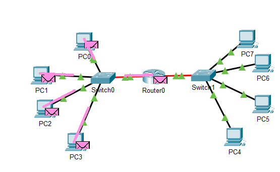

## Module 4 NetworkingFundamentals

### TASK 4.1

* Зібрати наступний проект (топологія 1), який містить в собі: 4 ПК типу PC-PT, Концентратор(Hub-PT).
Кожен  комп'ютер  повинен  бути  з'єднаний  з концентратором за допомогою крученої пари (Copper Straight-through).

* Кожному  ПК  привласнити  унікальну IP  адресу.

* Перевірити  працездатність  отриманої  мережі  шляхом  здійснення 
Інтернет  запитів  (ICMP  пакетів)  від  одного  ПК  до  іншого.

* Перейти  в  режим _Simulation_ і  за  допомогою  кнопки _EventList_ викликати вікно відображення подій в мережі SimulationPanel.
Простежити  за  порядком  і  шляхом  проходження  пакетів  у  вікні Simulation Panel. Зберегти даний скріншот.
Переглянути  інформацію опакетах  з  вікна SimulationPanelі  їх відповідність моделі OSI. Результати зберегти як скриншот.

  * Проходження пакетів:
  
  
  
  * Інформація про пакет відповідна до моделі OSI:
  
  

* Видалити  IP  адреса  з  кожною  локальною  машини  PC0 -PC3. Проаналізувати відмінності в роботі мережі.

Пакети не обробляються без IP адрес: 

* Зібрати наступний проект (топологія 2). У нього входять: PC0-PC5, Server, 2  Hubs.
Кожному мережному компоненту привласнити IP адресу.
Перевірити працездатність мережі.

* Створити  новий  проект (топологія 3),  який  включає  в  себе:  4  ПК  типу  PC-PT, Комутатор (Switch).
Проаналізувати відмінності в роботі мережі Топології 1 і Топології 3.

Комутатор на відміну від хаба вивчає відповідність мак адреси пристроїв відповідно до портів, і не бродкаастить кожен пакет

SimulationPanel:

Packet structure:

* Розширити проект до такого вигляду (топологія 4). У нього входять: 8 ПК типу PC-PT, 2 комутатори (Switch).
  За необхідністю додати  додаткові  порти  на  комутатори.
  Кожному мережному компоненту привласнити IP адрес. Перевірити працездатність мережі.

* Існуючу  мережу  розбити  на  дві  рівні  підмережі.  І  з'єднати  їх  за допомогою   маршрутизатора   Router-PT   з   декількома   портами.
  Порти  маршрутизатора  слід  включити  (On)  і  призначити  їм  IP адреси в діапазоні обраної підмережі.
  На кожному з комп'ютерів (РС0 -РС7) необхідно позначити шлюз.
  Перевірити працездатність мережі.
  

  
* Проаналізувати відмінності в роботі мережі Топології 4 і Топології 5. Оцінити можливості, які дає використання маршрутизатора.

В _Топології 5_ дві мережі внаслідок використання роутера. Якщо при _Топології 4_ мережа велика, бродкаст спам (шторм) буде значно навантажувати свічі та кінцеві пристрої.
Роутер розділяє бродкаст домен. Також роутер обрабляє пакети на мережевому рівні OSI і дозволяє маніпулювати пакетами на основі IP адрес в них.