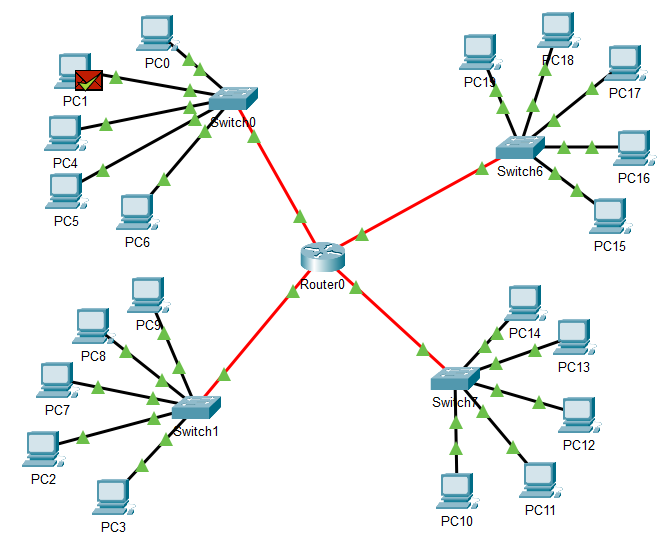
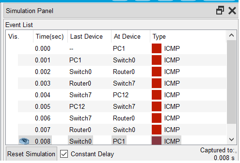
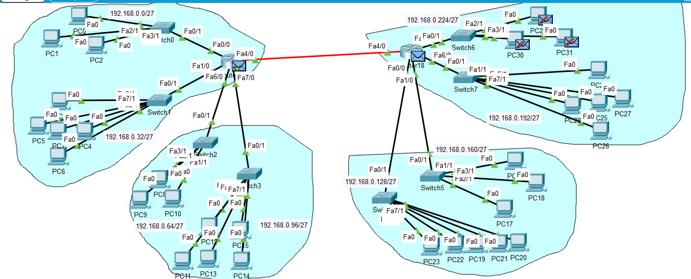
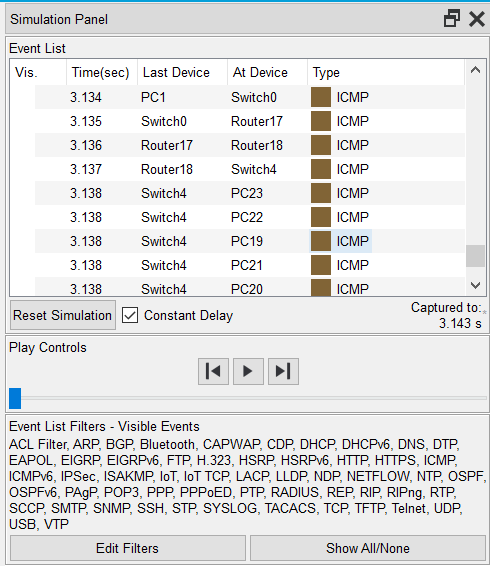
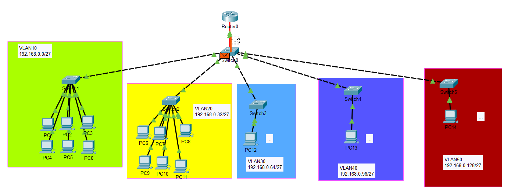
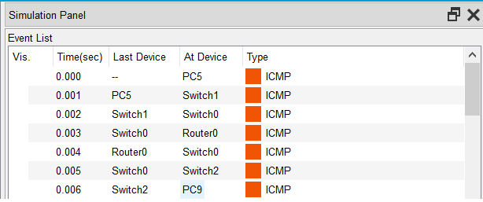
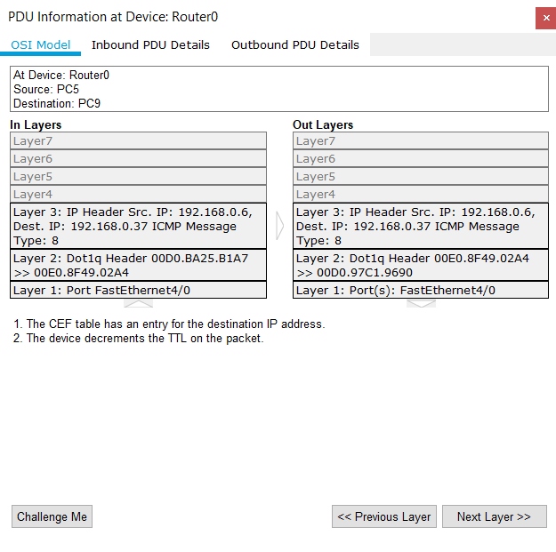

## Module -NetworkingFundamentals

### TASK 4.2


#### Завдання 1.

Необхідно змоделювати корпоративну мережу організації, яка містить 2  будинки  по  2  поверхи  в  кожному.
Горизонтальна  підсистема  поверху складається з однієї робочої групи по 5 комп'ютерів.
Провести аналіз працездатності мережі і її трафіку.

В цій топології всі чотири мережі під'єднані до роутера напряму:



Обмін пакетами:



#### Завдання 2.

Необхідно змоделювати корпоративну мережу організації, яка містить 1  будинок  з  чотирма  поверхами.
Горизонтальна  підсистема  поверху складається з двох робочих груп по 3 і 5 комп'ютерів відповідно.
Провести логічну структуризацію мережі на 8 підмереж (відповідно до  кількості  робочих  груп).
Провести  аналіз  працездатності  мережі  і  її трафіку.

Хай мережа 192.168.0.0/24
Розбиття на 8 підмереж означає використання 3 додаткових біт для підмережі. Маска буде /27.
Відповідно підмережі 192.168.0.[0, 32, 64, 92, 128, 160, 192, 224]/27,
Використовується 2 маршрутизатора, бо надійніше і в 1 роутера замало портів.
Для портів між маршрутизаторами обрана довільна мережа 10.0.0.0/30.



Використана динамічна маршрутизація OSPF:

```
Router>enable
Router#config term
Enter configuration commands, one per line.  End with CNTL/Z.
Router(config)#router ospf 1
Router(config-router)#network 0.0.0.0 255.255.255.255 area 0
```

Проходження пакету до хоста не підключеного до роутера відправника напряму



Завдання 3.Необхідно  змоделювати  локальну  мережу  комплексу  з  5 одноповерхових будівель.
Одна будівля -1 робоча група по 6 комп'ютерів.
Мережа будується на основі маршрутизатора з одним портом. 

На роутері для маршрутизації між vlan використовуються підінтерфейси з налаштуванням тегування за допомогою dot1q (IEEE 802.1Q)
По суті дана топологія з роутером (Router-on-a-Stick) може бути замінена комутатором 3го рівня (принаймні я так чув).



Проходження пакету:



Dot1q є протоколом Data Link рівня:



Налаштування підінтерфейсу на роутері:

```
Router>enable
Router#config terminal
Enter configuration commands, one per line.  End with CNTL/Z.
Router(config)#int fa4/0
Router(config-if)#no shutdown
Router(config-if)#int fa4/0.10
Router(config-subif)#encapsulation dot1q 10
Router(config-subif)#ip add 192.168.0.1 255.255.255.224
...
```
 