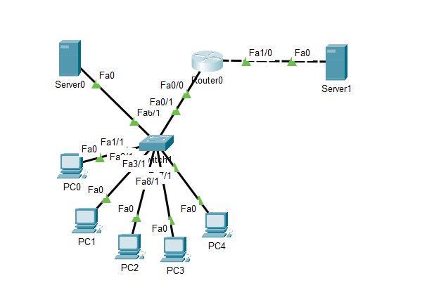
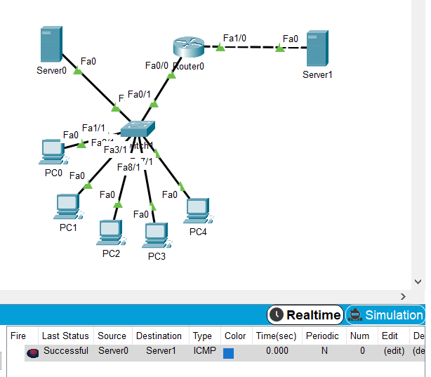

## Module - NetworkingFundamentals

### TASK4.3

#### Завдання:

Побудувати  локальну  мережу,  що  складається  з  сегмента  на  основі комутатора з 5  комп'ютерів і сервера.  
Комутатор з'єднаний з маршрутизатором, до якого також підключений сервер.  
Необхідно задати статичні IP адреси мережних інтерфейсів маршрутизаторів, локальних   комп'ютерів   і   серверів.  
Налаштувати маршрутизацію по протоколу RIP.Домогтися можливості пересилання  даних по протоколу  ICMP  між усіма об'єктами мережі.  

1. Розставляємо  на  робочому  полі  необхідні  вузли,  використовуючи браузер в нижній частині вікна. 
З'єднуємо вузли відповідно до завдання за допомогою крученої пари.



2. Задамо  ip-адреси  вузлів  сегмента  в  діапазоні  192.168.0.х,  а  сервера, підключеного   до   маршрутизатора - 192.168.1.1.
Маска   підмережі - 255.255.255.0.

3. Задамо  відповідні  ip  адреси  на  інтерфейсах  маршрутизатора  і включимо ці порти.

4. Зайдемо в Command Line Interface  маршрутизатора  і  за  допомогою команди enable secret задамо пароль для  доступу і збережемо конфігурацію.

```
Router(config)#enable secret 12345
Router(config)#exit
Router#
%SYS-5-CONFIG_I: Configured from console by console

Router#copy running-config startup-config
Destination filename [startup-config]? 
Building configuration...
[OK]
```

5. Для  налаштуваннямаршрутизації  по  протоколу  RIP  відкриємо вкладку  Config  у  вікні  властивостей  маршрутизатора  і  виберемо  пункт  RIP.
Задамо там адреси всіх підмереж, яким дозволено спілкування.

Перевіряємо  доступність  робочих  станцій.
Для  цього  в  правій  колонці вибираємо  інструмент  Addsimple  PDU  і  вибираємо  станцію-відправник  і станцію-одержувач.
Переконуємося,  що  передача  завершена  успішно.




