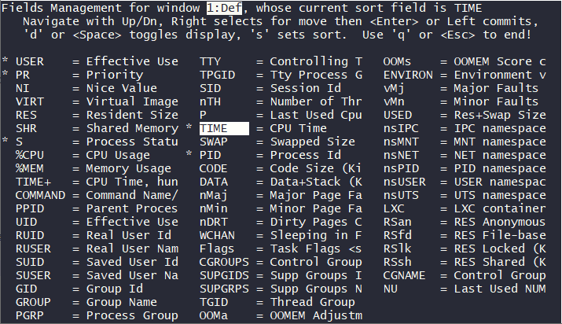
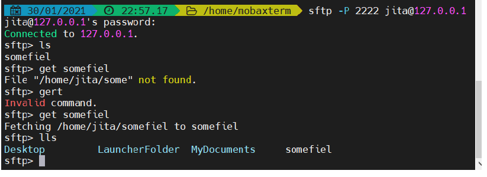
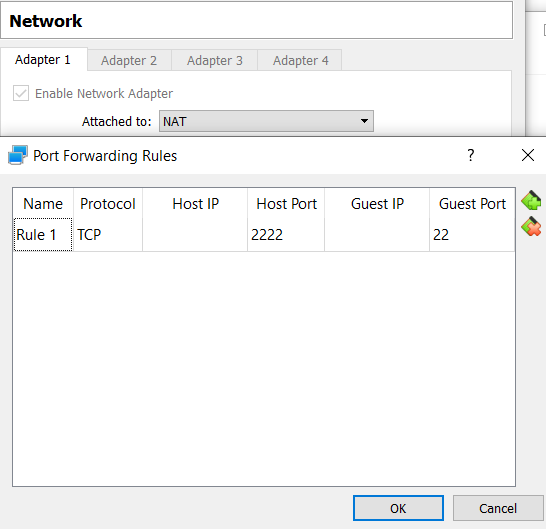
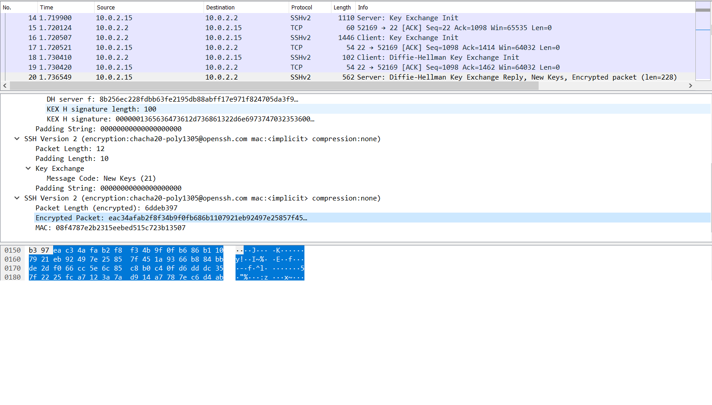
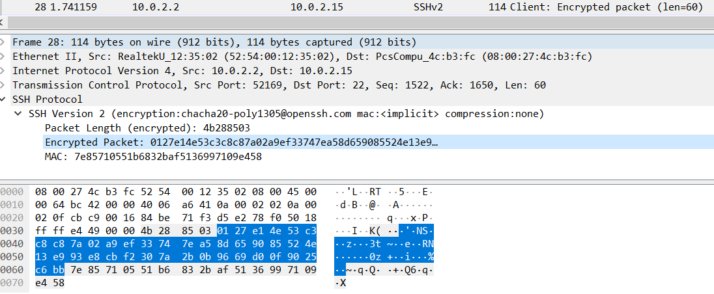
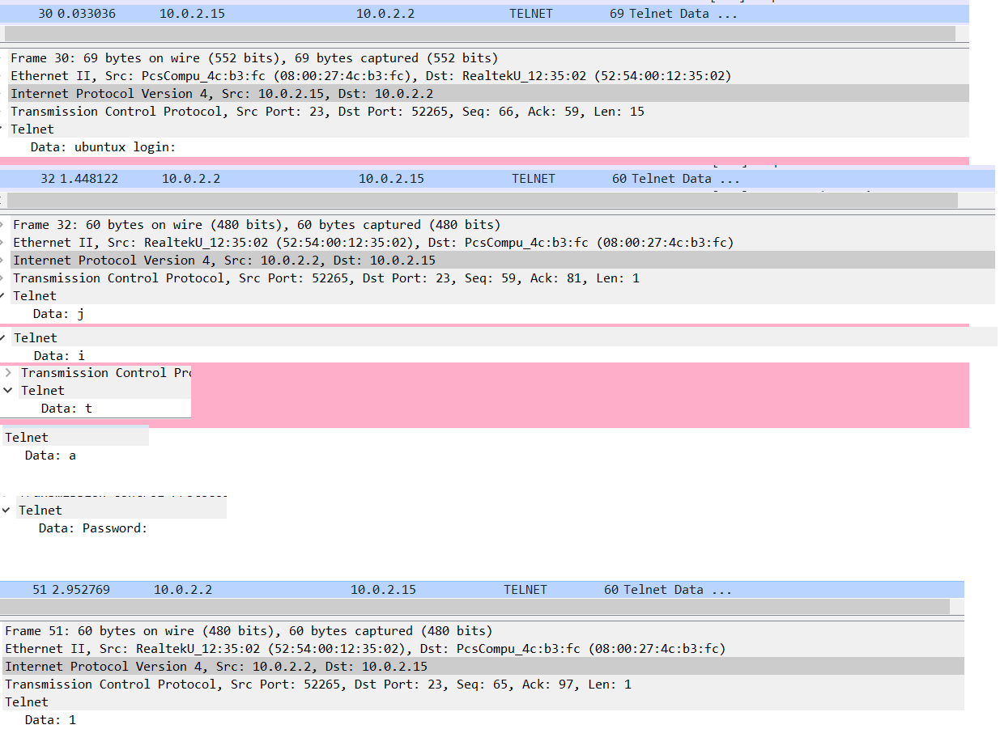

### TASK5.3

#### Part1

1. How many states could has a process in Linux?

5 (ps man):
  * R  running or runnable (on run queue)
  * D  uninterruptible sleep (usually IO)
  * S  interruptible sleep (waiting for an event to complete)
  * Z  defunct/zombie, terminated but not reaped by its parent
  * T  stopped, either by a job control signal or because it is being traced

2. Examine the pstree command. Make output (highlight) the chain (ancestors) of the current process.

> `-h` Highlight the current process and its ancestors, do NOT works if terminal does not support highlighting

```
jita@ubuntux:~$ pstree -h
systemd─┬─accounts-daemon───2*[{accounts-daemon}]
        ├─atd
        ├─cron
        ├─dbus-daemon
        ├─login───bash
        ├─multipathd───6*[{multipathd}]
        ├─networkd-dispat
        ├─polkitd───2*[{polkitd}]
        ├─rsyslogd───3*[{rsyslogd}]
        ├─snapd───10*[{snapd}]
        ├─sshd───sshd───sshd───bash───pstree
        ├─systemd───(sd-pam)
        ├─systemd-journal
        ├─systemd-logind
        ├─systemd-network
        ├─systemd-resolve
        ├─systemd-timesyn───{systemd-timesyn}
        ├─systemd-udevd
        └─unattended-upgr───{unattended-upgr}
```

3. What is a proc file system?

proc filesystem (procfs) is a special filesystem in that presents information about processes in a file-like structure.  
The proc file system acts as an interface to internal data structures in the kernel.

4. Print information about the processor (its type, supported technologies, etc.).

> `lscpu`

```
jita@ubuntux:~$ lscpu
Architecture:                    x86_64
CPU op-mode(s):                  32-bit, 64-bit
Byte Order:                      Little Endian
Address sizes:                   39 bits physical, 48 bits virtual
CPU(s):                          1
On-line CPU(s) list:             0
Thread(s) per core:              1
Core(s) per socket:              1
Socket(s):                       1
NUMA node(s):                    1
Vendor ID:                       GenuineIntel
CPU family:                      6
Model:                           78
Model name:                      Intel(R) Core(TM) i3-6100U CPU @ 2.30GHz
```

5. Use the ps command to get information about the process.
 The information should be as follows: 
 the owner of the process, the arguments with which the process was launched for execution, the group owner of this process, etc.

```
jita@ubuntux:~$ ps -f
UID          PID    PPID  C STIME TTY          TIME CMD
jita        2610    2609  0 21:15 pts/0    00:00:00 -bash
jita        2658    2610  0 21:22 pts/0    00:00:00 ps -f
```

6. How to define kernel processes and user processes?

If the VSZ field in `ps l` or `ps u` is 0, it means the task has no user-space memory allocated, so process is in kernel space.  
For process that is started by user and not by the system `TTY` field other than '?'
  
```
jita@ubuntux:~$ ps aux
USER         PID %CPU %MEM    VSZ   RSS TTY      STAT START   TIME COMMAND
root           1  0.1  1.1 102144 11700 ?        Ss   13:28   0:02 /sbin/init ma
root           2  0.0  0.0      0     0 ?        S    13:28   0:00 [kthreadd]
...
jita         903  0.0  0.5  13904  5488 ?        S    13:35   0:00 sshd: jita@p
jita         904  0.0  0.5   8276  5076 pts/0    Ss   13:35   0:00 -bash
root         917  0.0  0.0      0     0 ?        I    13:40   0:00 [kworker/u2:
root         935  0.0  0.0      0     0 ?        I    13:43   0:00 [kworker/0:0
jita         943  0.0  0.3   8876  3264 pts/0    R+   13:47   0:00 ps aux
```

7. Print the list of processes to the terminal. Briefly describe the statuses of the processes. 
What condition are they in, or can they be arriving in?

```
jita@ubuntux:~$ ps aux
USER         PID %CPU %MEM    VSZ   RSS TTY      STAT START   TIME COMMAND
root           1  0.0  1.1 102144 11700 ?        Ss   13:28   0:02 /sbin/init m
root           2  0.0  0.0      0     0 ?        S    13:28   0:00 [kthreadd]
...
jita        1122  0.0  0.3   8876  3304 pts/0    R+   15:35   0:00 ps aux
```

The `STAT` field is process status:
 * D uninterruptible sleep (usually IO)
 * R    running or runnable (on run queue)
 * S    interruptible sleep (waiting for an event to complete)
 * T    stopped, either by a job control signal or because it is being traced.
 * W    paging (not valid since the 2.6.xx kernel)
 * X    dead (should never be seen)
 * Z    defunct ("zombie") process, terminated but not reaped by its parent.

Additional characters may be displayed (`+` - is in the foreground process group).

8. Display only the processes of a specific user.

```
jita@ubuntux:~$ ps -u jita
    PID TTY          TIME CMD
    766 ?        00:00:00 systemd
    768 ?        00:00:00 (sd-pam)
    903 ?        00:00:00 sshd
    904 pts/0    00:00:00 bash
    970 pts/0    00:00:00 ps
```

9. What utilities can be used to analyze existing running tasks (by analyzing the help for the ps command)?

  * ps has option _r_ that displays only running processes
  * pgrep can get PID by name
  * top commmand displays running processes and is interactive

10. What information does top command display?

  `top` command displays currently running processes and , unlike `ps`, their resources consumption in real time.  

12. Display the processes of the specific user using the top command.

  `top U <username>` option displays processes of a user

12. What interactive commands can be used to control the top command? Give a couple of examples.
  
  * h  :help
  * r  :renice You will be prompted for a PID and a nice value (priority for user space).
  * R  :Reverse/Normal-Sort-Field toggle 
  * <, >  :Move sort column: '<'/'>' left/right  
  * f,F - choose fieds to display or sort

13. Sort the contents of the processes window using various parameters (for example, the amount of processor time taken up, etc.)

using `f` interactive command and entering button `s` on desired field:



```
USER      PR S   TIME     PID
jita      20 S   0:02     903
root      20 S   0:02     580
root      20 S   0:02       1
root      20 I   0:01      11
root      20 I   0:01    1150
...
```

14. Concept of priority, what commands are used to set priority?

Priority is used to allocate more resources to more demanding processes.  
Process have priority and nice value: **Priority_value = Nice_value + 20**

`renice [-n] <new_nice_value> [-p] <PID>` used to change priority

15. Can I change the priority of a process using the top command? If so, how?

Yes, via `r` option,  you will be prompted for PID and then new nice value

16. Examine the kill command. How to send with the kill command process control signal? 
Give an example of commonly used signals.

`kill -l` lists availaible signals

Signals are sent like : `kill -<signame> PID` or `kill -<signumber> PID`

Signal examples:

  * 9 :SIGKILL, kills(stops) a process
  * 2 :SIGINT interrunpts a process, but process can ignore
  * 19:SIGSTOP - This signal makes the operating system pause a process's execution. The process cannot ignore the signal.

17. Commands jobs, fg, bg, nohup. What are they for? Use the sleep, yes command to demonstrate the process control mechanism with fg, bg.

`jobs` displays currently running, done or stopped tasks  
`fg` moves job to foreground  
`bg` moves job to background, if job was stopped it exucution continues

Here dull job is created in background using `sleep` command, then `fg` used to move execution to foreground and `Ctrl+Z` stops it. 
By issuing `bg` command current job is sent to background and continues execution.

```
jita@ubuntux:~$ sleep 360 &
[1] 14103
jita@ubuntux:~$ fg
sleep 360
^Z
[1]+  Stopped                 sleep 360
jita@ubuntux:~$ jobs
[1]+  Stopped                 sleep 360
jita@ubuntux:~$ bg
[1]+ sleep 360 &
jita@ubuntux:~$ jobs
[1]+  Running                 sleep 360 &
```

#### Part2

1. Check the implementability of the most frequently used OPENSSH commands in the MS Windows operating system.  
(Description of the expected result of the commands + screenshots: command – result should be presented)

* `ssh` <username>@<remote_host_ip> [-p <port>]

You will be prompted for password if it was not specified.

```
$ ssh -p 2222 jita@127.0.0.1
jita@127.0.0.1's password:
Welcome to Ubuntu 20.04.1 LTS (GNU/Linux 5.4.0-64-generic x86_64)
 * Documentation:  https://help.ubuntu.com
 * Management:     https://landscape.canonical.com
...
```

* `sftp`

Usage:



For _Windows_ there are plenty of GUI tools that simplify mentioned above commands e.g. _MobaXterm_.  

2. Implement basic SSH settings to increase the security of the client-server connection

In _/etc/ssh/sshd_config_:

  * Change port to random:
  `Port 8976`
  
  * Disable root login
  `PermitRootLogin no`

  * Set A Login Grace Timeout
  `LoginGraceTime 30`
  
  * Set Maximum Startup Connections
  `MaxStartups 4`
  
  * Log in with ssh keys instead of passwords, to disable password login set `PasswordAuthentication no

3. List the options for choosing keys for encryption in SSH. Implement 3 of them.

Keys are generated by `ssh-keygen` command.

> `ssh-copy-id <username@remote_host_IP>` helps to easy copy key to remote host for passwordless login 

  * -t : Specifies the type of key to create.  The possible values are “dsa”, “ecdsa”, “ecdsa-sk”, “ed25519”, “ed25519-sk”, or “rsa”.  
  default is rsa, ed25519 is considered more secure
  * -b : Specifies bit length of a key
  * -a : Number of rounds of key of key derivation function
  * -N : new_passphrase Provides the new passphrase.

Example:

```
jita@ubuntux:~$ ssh-keygen -t ed25519 -b 521 -N sugar -a 250 -f edkey.pem
Generating public/private ed25519 key pair.
Your identification has been saved in edkey.pem
Your public key has been saved in edkey.pem.pub
The key fingerprint is:
SHA256:1PWx3ovkS2LHNU9xBMxB5Wlb8gt6dCRYkm3/9ctacJo jita@ubuntux
The key's randomart image is:
+--[ED25519 256]--+
|           .+==+o|
|         . o++o=.|
|        . ....==+|
|       .     .+=*|
|        S    =.*B|
|            * X.B|
|           + E.+o|
|          . = oo |
|             o.  |
+----[SHA256]-----+
jita@ubuntux:~$ ls
edkey.pem  edkey.pem.pub  somefiel
```

4. Implement port forwarding for the SSH client from the host machine to the guest Linux virtual machine behind NAT.

In VirtualBox:



5. * Intercept (capture) traffic (tcpdump, wireshark) while authorizing the remote client on the server using ssh, telnet, rlogin. Analyze the result.

  * SSH
  
  SSH key exchange before actual data transmission results in symmetric session key:
  
 
  
  Data passed via SSH is encrypted: 
 
 
  
  * Telnet  
  Telnet connection is insecure and data is transfered unencrypted symbol by symbol.  
  Login and password captured by _tcpdump_:  
  
