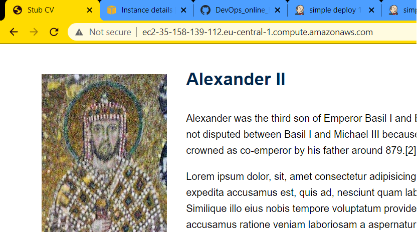

### Jenkins Task

2 AWS EC2 instances used. One jenkins server and one is apache server.  
For current task jenkins project is to simply deploy a web page.

Plugins:
* Git integration (with ssh key added to account) and webhook setup to build after each commit
* Publish over SSH - to copy webpage files (html, css, image) to /var/www/html on remote machine

Successfull job builds:


Latest build started by github webhook:


Console output (git fetched and then artifacts sent by ssh):

```
SuccessConsole Output
Started by GitHub push by InfraMarine
Running as SYSTEM
Building in workspace /var/lib/jenkins/workspace/simple deploy 1
The recommended git tool is: NONE
using credential aws-inframar-rsa
 > git rev-parse --is-inside-work-tree # timeout=10
Fetching changes from the remote Git repository
 > git config remote.origin.url git@github.com:InfraMarine/DevOps_online_Kyiv_2020Q42021Q1.git # timeout=10
Fetching upstream changes from git@github.com:InfraMarine/DevOps_online_Kyiv_2020Q42021Q1.git
 > git --version # timeout=10
 > git --version # 'git version 2.25.1'
using GIT_SSH to set credentials aws-inframar-rsa
 > git fetch --tags --force --progress -- git@github.com:InfraMarine/DevOps_online_Kyiv_2020Q42021Q1.git +refs/heads/*:refs/remotes/origin/* # timeout=10
 > git rev-parse refs/remotes/origin/main^{commit} # timeout=10
Checking out Revision 3a1f3ad7368346e55605a4f12995073c154f0bb9 (refs/remotes/origin/main)
 > git config core.sparsecheckout # timeout=10
 > git checkout -f 3a1f3ad7368346e55605a4f12995073c154f0bb9 # timeout=10
Commit message: "Update index.html"
 > git rev-list --no-walk 329af686978d2d2d3cd8de2c8764231eb121c198 # timeout=10
[simple deploy 1] $ /bin/sh -xe /tmp/jenkins3665230837447477424.sh
+ echo start
start
SSH: Connecting from host [ip-172-31-44-216]
SSH: Connecting with configuration [jenkins-agent1] ...
SSH: EXEC: completed after 201 ms
SSH: Disconnecting configuration [jenkins-agent1] ...
SSH: Transferred 4 file(s)
Finished: SUCCESS
```

Simple web page:



Content of _/var/www/html_ on apache ec2 instance:

```
ubuntu@ip-172-31-33-194:~$ ls -l /var/www/html
total 12
-rw-rw-r-- 1 ubuntu ubuntu    0 Mar  2 22:38 README.md
drwxrwxr-x 2 ubuntu ubuntu 4096 Mar  2 22:37 images
-rwxrwxrwx 1 root   root   2315 Mar  2 22:38 index.html
-rw-rw-r-- 1 ubuntu ubuntu 1540 Mar  2 22:38 styles_new.css
```