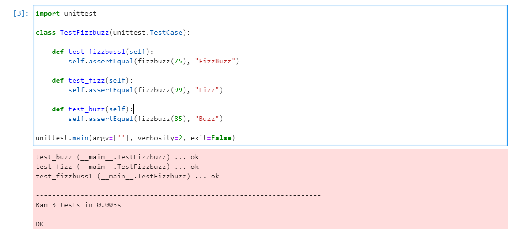
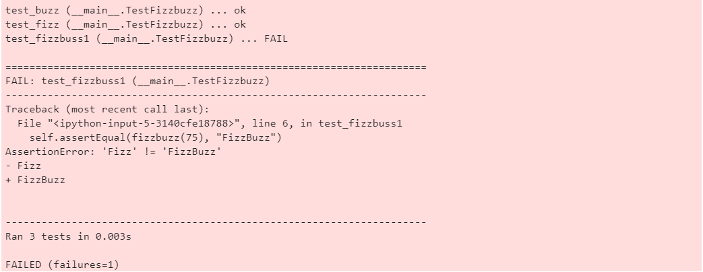

1. Develop fizzbuzz function for list of numbers from 1 to 100. (Check in Jupyter)
If number divided by 3 without rest, print “Fizz”,  
If number divided by 5 without rest, print “Buzz”,  
If number divided by 3 and 5 without rest, print “FizzBuzz”.  

Fizzbuzz function and testing part:

```
def fizzbuzz(x):
    res = ""
    if (x % 3 == 0):
        res += "Fizz"
    if (x % 5 == 0):
        res += "Buzz"
    return(res)

for i in range(1,101):
    if (fizzbuzz(i)):
        print(f"Fizzbuzz of {i}: {fizzbuzz(i)}")
```

Output for numbers 1 to 100:

```
Fizzbuzz of 3: Fizz
Fizzbuzz of 5: Buzz
Fizzbuzz of 6: Fizz
Fizzbuzz of 9: Fizz
Fizzbuzz of 10: Buzz
Fizzbuzz of 12: Fizz
...
```

1* Make unit tests for your new FizzBuzz function.

> `unittest` used

```
import unittest

class TestFizzbuzz(unittest.TestCase):
    
    def test_fizzbuss1(self):
        self.assertEqual(fizzbuzz(75), "FizzBuzz")
        
    def test_fizz(self):
        self.assertEqual(fizzbuzz(99), "Fizz")
    
    def test_buzz(self):
        self.assertEqual(fizzbuzz(85), "Buzz")
        
unittest.main(argv=[''], verbosity=2, exit=False)
```

Tests pass:



If to change second _if_ in fizzbuzz `if (x % 5 == 0):` to _elif_ then `test_fizzbuss1` fails:



2. Develop count_vowels function for counting vowels in input text.
Example of usage:  
count_vowels(annnmemmmtlo) = 3  
count_vowels(kj  js)=0

Function and invoking code:

```
def count_vowels(string):
    num_vowels=0
    str_low = string.lower()
    for char in string:
        if char in "aeiou":
           num_vowels += 1
    return num_vowels

print(f"Vowels in 'annnmemmmtlo': {count_vowels('annnmemmmtlo')}")
mystr = input("Enter string:")
print(f"Vowels in '{mystr}': {count_vowels(mystr)}")
```

Output:  
```
Vowels in 'annnmemmmtlo': 3
Enter string: hewwo
Vowels in 'hewwo': 2
```

##### Python Script exported from JupyterLab:
[script](taska.py)