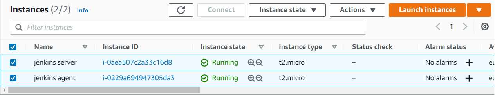
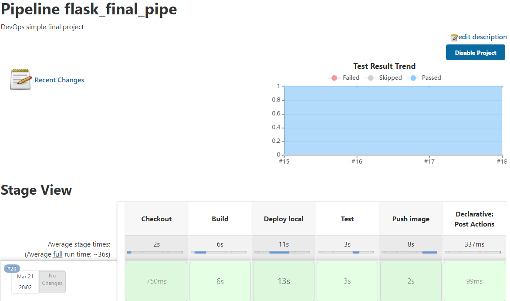
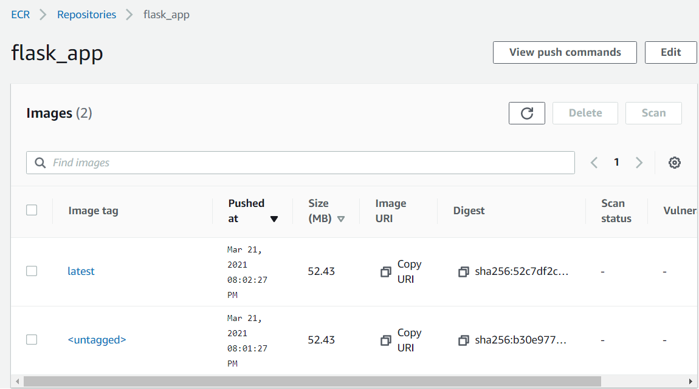
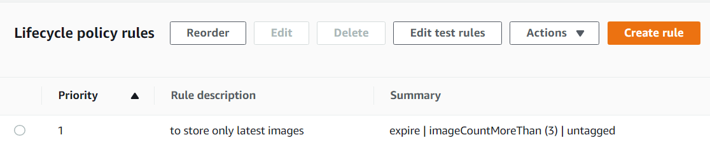

## Final project: CI/CD pipeline with flask app.

Flask app is simple web page that diplays visits cout (redis used):


Forked repo with some minor changes:

[repo](https://github.com/InfraMarine/flask-app.git)

Used:
 * Jenkins

> For this project I used only 2 instances.
> Master and Agent/Host with _Docker_ installed.



 * Ansible to set up Docker and git on an agent
   [ansible playbook](ansible/playbook_docker_git.yml)
 * _Git(Hub)_ and _AWS_
 
Pipeline:
  1. Checkout git (on jenkins agent with docker)
  2. Build docker image
  3. Deploy docker image on agent
  4. Execute tests on image via `docker exec` and copy results file via `docker cp`
  5. Push image to ECR repository



ECR:



ECR Lifepolicy to store no more than 3 untagged images was set:



Ansible playbook run:

```
jenkins@ip-172-31-44-216:/home/ubuntu/ansible$ ansible-playbook -i hosts -u ubuntu playbook_docker_git.yml

PLAY [Install git and docker] **************************************************

TASK [Gathering Facts] *********************************************************
ok: [172.31.33.194]

TASK [Install git] *************************************************************
ok: [172.31.33.194]

TASK [install pip3] ************************************************************
ok: [172.31.33.194]

TASK [Install required system packages] ****************************************
ok: [172.31.33.194] => (item=apt-transport-https)
ok: [172.31.33.194] => (item=ca-certificates)
ok: [172.31.33.194] => (item=curl)
ok: [172.31.33.194] => (item=software-properties-common)
ok: [172.31.33.194] => (item=gnupg)
ok: [172.31.33.194] => (item=lsb-release)

TASK [Add Docker GPG apt Key] **************************************************
ok: [172.31.33.194]

TASK [Add Docker Repository] ***************************************************
ok: [172.31.33.194]

TASK [Update apt and install docker-ce and compose] ****************************
ok: [172.31.33.194]

TASK [Instal docker python module (ansible needs it)] **************************
ok: [172.31.33.194]

TASK [adding existing user 'ubuntu' to group docker] ***************************
ok: [172.31.33.194]

TASK [Start service docker, if not running] ************************************
ok: [172.31.33.194]

PLAY RECAP *********************************************************************
172.31.33.194              : ok=10   changed=0    unreachable=0    failed=0    skipped=0    rescued=0    ignored=0

```